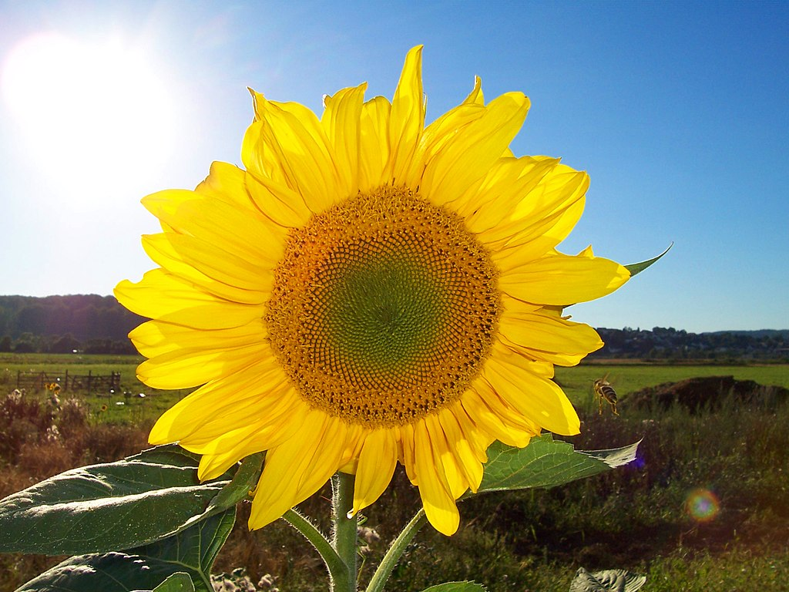

<!-- Main -->

<!-- One -->
<section id="one">
	

		<header class="major">
			<h2>¿Por qué pasar a este tipo de energías?</h2>
		</header>
		

	

</section>

<!-- Two -->
<section id="two" class="spotlights">
	<section>
			
		

			

				<header class="major">
					<h3>El IDAE publica una versión actualizada de la guía para tramitar y poner en marcha instalaciones de autoconsumo energético</h3>
				</header>
				
8 de agosto de 2019. El Instituto para el Ahorro y la Diversificación Energética (IDAE), dependiente del Ministerio para la Transición Ecológica, ha publicado una nueva versión, actualizada y completada, de la guía para facilitar la ciudadanía la tramitación y puesta en marcha de instalaciones de autoconsumo energético. Entre sus principales novedades, el documento incorpora una hoja de ruta que explica, en cinco pasos, los requisitos y potenciales beneficios del autoconsumo en hogares.

				<ul class="actions">
					<li><a href="https://www.idae.es/noticias/el-idae-publica-una-version-actualizada-de-la-guia-para-tramitar-y-poner-en-marcha" target="_blank" class="button">Saber más</a></li>
				</ul>
			

		

	</section>
	<section>
		
		

			

				<header class="major">
					<h3> Energía renovable</h3>
				</header>
				
Se denomina energía renovable a la energía que se obtiene de fuentes naturales virtualmente inagotables, ya sea por la inmensa cantidad de energía que contienen, o porque son capaces de regenerarse por medios naturales. Entre las energías renovables se cuentan la <strong>energía eólica</strong>, la geotérmica, la hidroeléctrica, la mareomotriz, <strong>la solar</strong>, la undimotriz, la biomasa y los biocarburantes.

				<ul class="actions">
					<li><a href="https://es.wikipedia.org/wiki/Energ%C3%ADa_renovable" class="button">Saber más</a></li>
				</ul>
			

		

	</section>
	<section>
		
		

			

				<header class="major">
					<h3>CENER - ENERGÍA SOLAR FOTOVOLTAICA</h3>
				</header>
				
El Departamento de ESFV tiene como objetivo principal la reducción del coste del kWh producido por medios fotovoltaicos. Es el punto intermedio entre la investigación básica y los entornos industriales de fabricación.
				Folleto Presentación Energía Solar 

				<ul class="actions">
					<li><a href="https://issuu.com/ceneronline/docs/cener-energia_solar_fotovoltaica-photovoltaic_sola" class="button">Saber más</a></li>
				</ul>
			

		

	</section>
</section>

<!-- Three 
<section id="three">
	

		<header class="major">
			<h2>Massa libero</h2>
		</header>
		
Nullam et orci eu lorem consequat tincidunt vivamus et sagittis libero. Mauris aliquet magna magna sed nunc rhoncus pharetra. Pellentesque condimentum sem. In efficitur ligula tate urna. Maecenas laoreet massa vel lacinia pellentesque lorem ipsum dolor. Nullam et orci eu lorem consequat tincidunt. Vivamus et sagittis libero. Mauris aliquet magna magna sed nunc rhoncus amet pharetra et feugiat tempus.

		<ul class="actions">
			<li><a href="generic.html" class="button next">Empecemos</a></li>
		</ul>
	

</section>
-->

<section id="three">
	
		
		<ul class="actions">
			<li><a href="index.html" class="button next">Empecemos</a></li>
		</ul>
	

</section>

