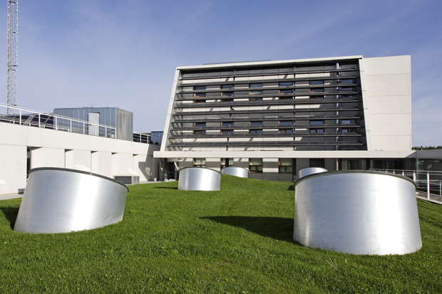

<!-- Main -->

<!-- One -->
<section id="one">
	

		<header class="major">
			<h2>¿Por qué cambiar a este tipo de energías limpias?</h2>
		</header>
		

	

</section>

<!-- Two -->
<section id="two" class="spotlights">
	<section>
			
		

			

				<header class="major">
					<h3>All of South Australia's power comes from solar panels in world first for major jurisdiction</h3>
					<h4>
Toda la energía de Australia del Sur proviene de paneles solares, la mayor región del mundo</h4>
				</header>
				
South Australia's renewable energy boom has achieved a global milestone.
Key points:
All of SA's power came from solar for one hour on October 11
The generation of too much solar power can create grid instability
A new interconnector planned with NSW will help manage the growth of solar power
The state once known for not having enough power has become the first major jurisdiction in the world to be powered entirely by solar energy.
For just over an hour on Sunday, October 11, 100 per cent of energy demand was met by solar panels alone.
"This is truly a phenomenon in the global energy landscape," Australian Energy Market Operator (AEMO) chief executive Audrey Zibelman said.

				<ul class="actions">
					<li><a href="https://www.abc.net.au/news/2020-10-25/all-sa-power-from-solar-for-first-time/12810366" target="_blank" class="button">Saber más</a></li>
				</ul>
			

		

	</section>
	<section>
			
		

			

				<header class="major">
					<h3>Germany hits 2 million PV system installations</h3>
					<h4>
Alemania alcanza los 2 millones de instalaciones de sistemas fotovoltaicos</h4>
				</header>
				
By the end of October, roughly 2 million PV systems were in operation across Germany, according to the German Solar Industry Association (BSW-Solar), which cited statistics from the the Federal Network Agency (Bundesnetzagentur).
The installed PV systems in Germany are able to generate around 50 billion kWh of electricity per year. They could theoretically cover the power consumption of 17 million average households. For BSW-Solar, this marks an “energy transition milestone.”
However, the association said that future deployment is uncertain, as the renewable energy law (EEF) will be amended in 2021. It warned that demand for rooftop PV could be halved. In addition, almost one in four PV systems is threatened by premature termination in the course of the 2020s, as the EEG draft has thus far failed to provide any economic options for the continued operation of PV systems that have been online for more than a decade.

				<ul class="actions">
					<li><a href="https://www.pv-magazine.com/2020/12/04/germany-hits-2-million-pv-system-installations/" target="_blank" class="button">Saber más</a></li>
				</ul>
			

		

	</section>
	<section>
			
		

			

				<header class="major">
					<h3>Diez claves del acuerdo "Chile-Madrid Tiempo de Actuar" de la COP25 de Madrid</h3>
				</header>
				
El acuerdo "Chile-Madrid Tiempo de Actuar" con el que ha concluido este domingo la vigésimo quinta Conferencia de las Partes (COP25) del Clima de Naciones Unidas, sienta las bases para una mayor ambición frente a la emergencia climática y abre un nuevo ciclo en estas reuniones de Naciones Unidas basadas en la acción y que todos los participantes hagan más y más rápido.

				<ul class="actions">
					<li><a href="https://www.efe.com/efe/america/portada/diez-claves-del-acuerdo-chile-madrid-tiempo-de-actuar-la-cop25/20000064-4132900" target="_blank" class="button">Saber más</a></li>
				</ul>
			

		

	</section>
	<section>
			
		

			

				<header class="major">
					<h3>El IDAE publica una versión actualizada de la guía para tramitar y poner en marcha instalaciones de autoconsumo energético</h3>
				</header>
				
8 de agosto de 2019. El Instituto para el Ahorro y la Diversificación Energética (IDAE), dependiente del Ministerio para la Transición Ecológica, ha publicado una nueva versión, actualizada y completada, de la guía para facilitar la ciudadanía la tramitación y puesta en marcha de instalaciones de autoconsumo energético. Entre sus principales novedades, el documento incorpora una hoja de ruta que explica, en cinco pasos, los requisitos y potenciales beneficios del autoconsumo en hogares.

				<ul class="actions">
					<li><a href="https://www.idae.es/noticias/el-idae-publica-una-version-actualizada-de-la-guia-para-tramitar-y-poner-en-marcha" target="_blank" class="button">Saber más</a></li>
				</ul>
			

		

	</section>
	<section>
		
		

			

				<header class="major">
					<h3> Energía renovable</h3>
				</header>
				
Se denomina energía renovable a la energía que se obtiene de fuentes naturales virtualmente inagotables, ya sea por la inmensa cantidad de energía que contienen, o porque son capaces de regenerarse por medios naturales. Entre las energías renovables se cuentan la <strong>energía eólica</strong>, la geotérmica, la hidroeléctrica, la mareomotriz, <strong>la solar</strong>, la undimotriz, la biomasa y los biocarburantes.

				<ul class="actions">
					<li><a href="https://es.wikipedia.org/wiki/Energ%C3%ADa_renovable" class="button">Saber más</a></li>
				</ul>
			

		

	</section>
	<section>
		
		

			

				<header class="major">
					<h3>CENER - ENERGÍA SOLAR FOTOVOLTAICA</h3>
				</header>
				
El Departamento de ESFV tiene como objetivo principal la reducción del coste del kWh producido por medios fotovoltaicos. Es el punto intermedio entre la investigación básica y los entornos industriales de fabricación.
				Folleto Presentación Energía Solar 

				<ul class="actions">
					<li><a href="https://issuu.com/ceneronline/docs/cener-energia_solar_fotovoltaica-photovoltaic_sola" class="button">Saber más</a></li>
				</ul>
			

		

	</section>
		<section>
		
		

			

				<header class="major">
					<h3>XATAKA - Si mañana me compro un coche eléctrico</h3>
				</header>
				
¿qué necesito saber sobre dónde y cómo cargarlo? 

				<ul class="actions">
					<li><a href="https://www.xataka.com/automovil/manana-me-compro-coche-electrico-que-necesito-saber-donde-como-cargarlo" class="button">Saber más</a></li>
				</ul>
			

		

	</section>
</section>

<!-- Three 
<section id="three">
	

		<header class="major">
			<h2>Massa libero</h2>
		</header>
		
Nullam et orci eu lorem consequat tincidunt vivamus et sagittis libero. Mauris aliquet magna magna sed nunc rhoncus pharetra. Pellentesque condimentum sem. In efficitur ligula tate urna. Maecenas laoreet massa vel lacinia pellentesque lorem ipsum dolor. Nullam et orci eu lorem consequat tincidunt. Vivamus et sagittis libero. Mauris aliquet magna magna sed nunc rhoncus amet pharetra et feugiat tempus.

		<ul class="actions">
			<li><a href="generic.html" class="button next">Empecemos</a></li>
		</ul>
	

</section>
-->

<section id="three">
	
		
		<ul class="actions">
			<li><a href="index.html" class="button next">Empecemos</a></li>
		</ul>
	

</section>

